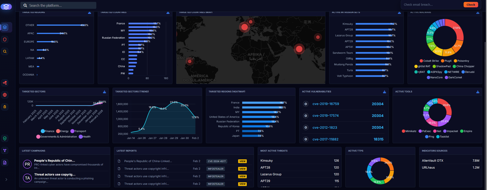

# Cyber Atlas

Cyber Atlas is a threat intelligence platform built with FastAPI, PostgreSQL,
Redis, OpenSearch, and Celery. It collects, stores, searches, and visualizes
Indicators of Compromise, MITRE ATT&CK-related entities, vulnerability data,
and threat intelligence feed results through an authenticated web dashboard.



## Features

- Threat feed collection from URLhaus, MalwareBazaar, ThreatFox, AlienVault OTX,
  and AbuseIPDB.
- IOC storage and search for IP addresses, domains, URLs, and hashes.
- JWT authentication, refresh tokens, role-based admin functions, and API keys.
- Dashboard views for KPIs, targeted countries, sectors, campaigns, reports,
  malware, tools, TTPs, and active vulnerabilities.
- PostgreSQL persistence, Redis caching/task broker, and OpenSearch indexing.
- Celery workers and Celery Beat scheduling for background collection jobs.
- Security middleware for rate limiting, request-size limits, and HTTP headers.

## Technology Stack

- Python 3.11
- FastAPI
- PostgreSQL 16
- Redis 7
- OpenSearch 2.11
- Celery and Celery Beat
- Docker Compose
- Static HTML, CSS, and JavaScript dashboard

## Project Structure

```text
cyber_atlas_backend/
|-- app/
|   |-- connectors/      # Threat intelligence feed connectors
|   |-- core/            # Configuration, database, logging, security
|   |-- crud/            # Database operations
|   |-- middleware/      # Security and request middleware
|   |-- models/          # SQLAlchemy models
|   |-- routes/          # API endpoints
|   |-- schemas/         # Pydantic schemas
|   |-- services/        # Domain services
|   `-- tasks/           # Celery tasks and scheduling
|-- frontend_static/     # Web dashboard assets
|-- alembic/             # Database migrations
|-- scripts/             # Operational scripts
`-- tests/               # Automated tests
```

## Quick Start

### Prerequisites

- Docker and Docker Compose
- Git
- Python 3.11+ for local development

### Configuration

Create a local environment file from the template:

```bash
cp .env.example .env
```

Edit `.env` and replace every placeholder credential before starting the
services. Real `.env` files are intentionally ignored by Git and must never be
committed.

For production-like deployments, use `.env.production.example` as a template
and generate new secrets for every environment.

### Run With Docker Compose

```bash
docker compose up -d
```

Available local services:

- Dashboard: http://localhost:8000/static/dashboard.html
- Login page: http://localhost:8000/static/index.html
- API documentation: http://localhost:8000/docs
- Flower task monitor: http://localhost:5555

The default admin account is configured through:

- `DEFAULT_ADMIN_EMAIL`
- `DEFAULT_ADMIN_PASSWORD`

Change the default password immediately after first login in any shared or
production environment.

## API Usage

Authenticate with the configured admin account:

```bash
curl -X POST http://localhost:8000/api/auth/login \
  -H "Content-Type: application/x-www-form-urlencoded" \
  -d "username=admin@cyberatlas.local" \
  -d "password=<your-password>"
```

Use the returned access token for authenticated API calls:

```bash
curl http://localhost:8000/api/search/iocs?q=malware \
  -H "Authorization: Bearer <access-token>"
```

Trigger feed collection:

```bash
curl -X POST http://localhost:8000/api/feeds/pull \
  -H "Authorization: Bearer <access-token>"
```

## Security

This repository is prepared to avoid accidental secret disclosure:

- `.env`, `.env.production`, virtual environments, logs, caches, local data, and
  Celery runtime files are ignored by Git.
- Example environment files contain placeholders only.
- A local secret scanning script is included at `scripts/secret_scan.py`.
- GitHub Actions runs the same secret scan on pushes and pull requests.
- Dependabot configuration is included for dependency update visibility.

Run the local secret scan before pushing:

```bash
python scripts/secret_scan.py
```

For stronger local protection, install pre-commit and enable the repository
hook:

```bash
pip install pre-commit
pre-commit install
```

See `SECURITY.md` for the project security policy.

## Testing

Install dependencies and run tests locally:

```bash
pip install -r requirements.txt
pytest
```

For a quick syntax check:

```bash
python -m compileall app tests scripts
```

## GitHub Publishing Checklist

Before pushing to GitHub:

1. Keep the repository private unless the thesis requires a public submission.
2. Confirm `.env` and `.env.production` are ignored.
3. Run `python scripts/secret_scan.py`.
4. Rotate any credentials that were ever shared outside the local machine.
5. Add only a remote repository that you control.

## License

No open-source license has been selected yet. Until a license is added, all
rights are reserved by the project author.
